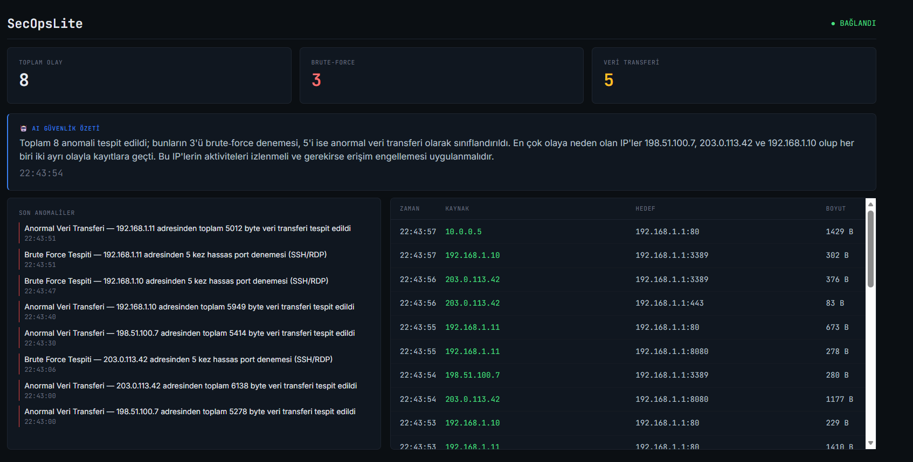
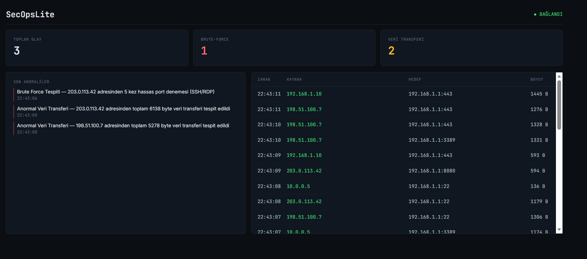

# SecOpsLite

Gerçek zamanlı ağ trafiği izleme ve anomali tespit sistemi. Ağ paketlerini (şu an simüle edilmiş, ileride gerçek trafiğe genişletilebilir) canlı olarak işler, kural tabanlı analiz ile şüpheli aktiviteyi (brute-force denemeleri, anormal veri transferi) tespit eder, tespit edilen olayları kalıcı olarak saklar, ve Groq LLM ile periyodik doğal dil güvenlik özetleri üretir.



## Özellikler

- 📡 **Gerçek zamanlı veri akışı** — `System.Threading.Channels` ile producer-consumer pipeline, paket üretimi ve işlenmesi birbirinden bağımsız çalışır
- 🔍 **Kural tabanlı anomali tespiti** — LINQ ile brute-force ve anormal veri transferi tespiti, genişletilebilir kural mimarisi (`IAnormalyRule`)
- 🔔 **Akıllı bildirim** — aynı olayın tekrar tekrar bildirilmesini önleyen cooldown mekanizması
- 📊 **Canlı dashboard** — SignalR (hem Hub hem Client tarafı) ile Worker'dan Web'e gerçek zamanlı veri akışı, koyu "terminal" temalı arayüz
- 💾 **Kalıcı depolama** — EF Core + PostgreSQL ile tespit edilen olayların kaydı
- 🤖 **AI destekli özet** — Groq API ile, önceden hesaplanmış istatistiklere dayalı periyodik güvenlik raporu
- 🐳 **Tam containerize edilmiş** — tek komutla (`docker compose up`) ayağa kalkan üç servisli sistem

## Mimari

Sistem, iki bağımsız .NET projesinden oluşuyor, aralarında **kod paylaşımı yok** — sadece ağ üzerinden (SignalR) konuşuyorlar:

SecOpsLite.Worker → arka planda çalışır: paket üretir/işler, anomali tespit eder,
veritabanına yazar, AI özeti üretir, Web'e SignalR ile bağlanır
SecOpsLite.Web → Blazor Server dashboard, SignalR Hub barındırır,
Worker'dan gelen veriyi canlı olarak gösterir

Bu ayrım bilinçli: `PriceTracker.Worker`'ın aksine (orada Api'ye proje referansı vardı), burada Worker ve Web **birbirinin kaynak koduna hiç erişmiyor** — production'da farklı makinelerde çalışabilecek şekilde tasarlandı.

### Veri Akışı
FakePacketGenerator → Channel<NetworkPacket> → PacketConsumer
↓ ↓ ↓
SignalR (Dashboard) AnormalyDetector (10sn pencere)
↓
PostgreSQL (AnomalyEvents)
↓
SummaryWorker (60sn'de bir) → Groq API
↓
SignalR (Dashboard'a özet)

## Teknoloji Yığını

- **Backend:** .NET 8 Worker Service, `System.Threading.Channels`, Entity Framework Core, PostgreSQL
- **Frontend:** Blazor Server, SignalR (Hub + Client)
- **AI:** Groq API (Llama modeli)
- **Containerization:** Docker, Docker Compose (multi-stage build)

## Kurulum ve Çalıştırma

### Docker ile (önerilen)

```bash
git clone <repo-url>
cd SecOpsLite
```

`.env` dosyası oluştur:
POSTGRES_PASSWORD=...
GROQ_API_KEY=...

```bash
docker compose up --build
```

Dashboard: `http://localhost:5128/dashboard`

### Yerelde (geliştirme)

```bash
docker compose up -d postgres
```

İki ayrı terminalde:
```bash
cd SecOpsLite.Web && dotnet run
cd SecOpsLite.Worker && dotnet run
```

Secrets, User Secrets ile yönetilir:
```bash
dotnet user-secrets set "Groq:ApiKey" "..."
dotnet user-secrets set "ConnectionStrings:DefaultConnection" "..."
```

## Öğrenme Odağı

Bu proje, PriceTracker'dan farklı olarak **C# ve .NET'in daha az kullanılan köşelerini** (`Channels`, SignalR'ın hem sunucu hem client tarafı, event-driven pipeline mimarisi) öğrenmek amacıyla geliştirildi. Aşamalar:
Sahte veri üretici → Channels ile pipeline → SignalR dashboard → LINQ ile anomali tespiti → PostgreSQL ile kalıcılık → AI özet

Şu an ağ trafiği **simüle edilmiş** veridir (gerçek paket yakalama, `SharpPcap` ile ileride eklenebilir bir genişletme olarak planlanmıştır).

## Ekran Görüntüsü


